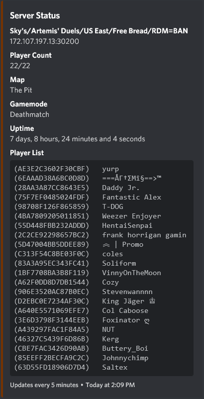
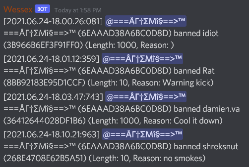
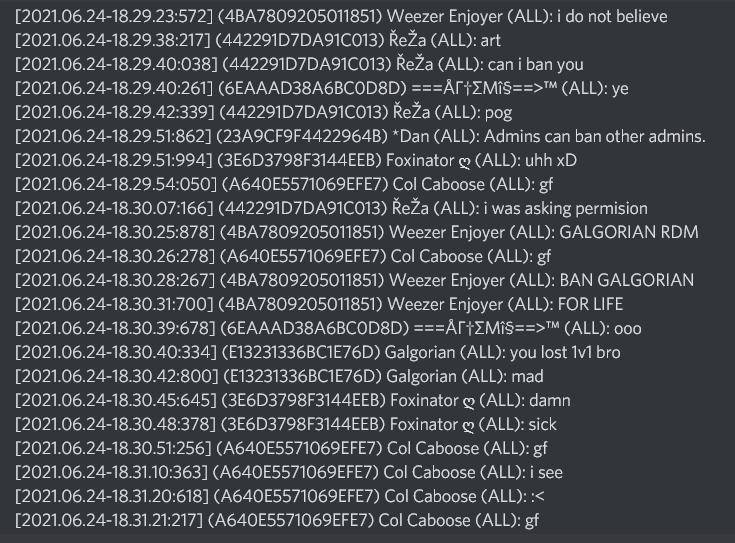

# wessex
**A log-reading bot for mordhau.**

For servers that don't have RCON support (like gportal), this bot can read the logs via FTP and pull relevant info into discord.

## Features

### Server status

Can track who is in the server and other server info.

 

### Administrative tracking

Currently detects cbans, unbans, kicks, mutes, unmutes.

### Chat tracking with batching

The bot can easily keep up with chat thanks to batching chat messages.

*A single batched chat message.*